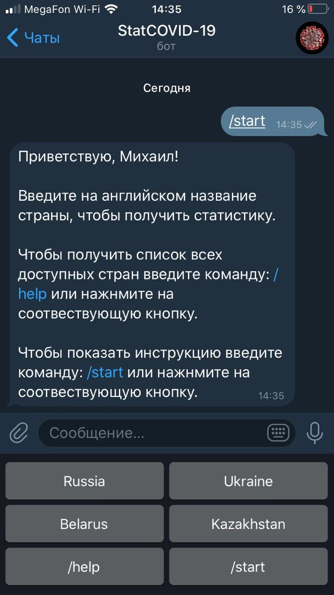
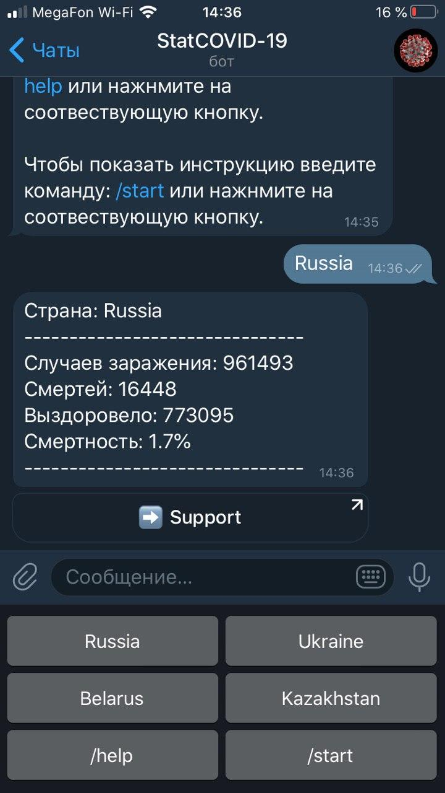

# StatCOVID-19

Данный бот для Telegram помогает быстро получить информацию о количестве (заболевших/выздоровевших/смертей) "COVID-19" в той или иной стране мира.

Данный бот работает на локальном сервере, если Вам интересно его протестировать, пишите в личные сообщения, я дам доступ.

<b>Интерфейс:</b>

1) Привественное сообщение и краткое описание функционала:

2) Пример вывода информации по запросу:

